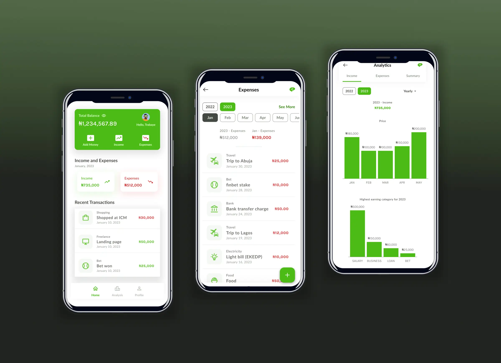
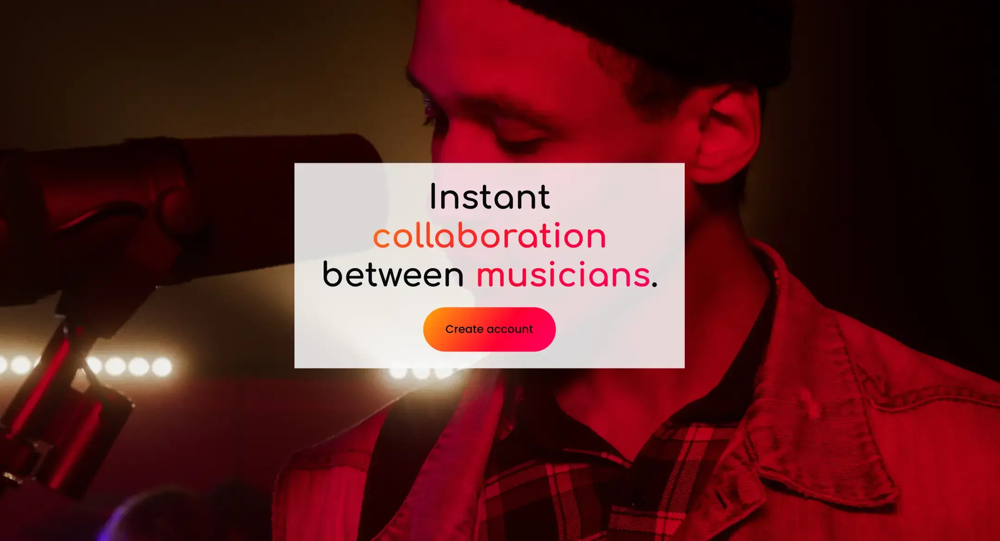

 
Ayo

 

---

 

# pixelAyo

> Where Ayo's pixels meet perfection!

Hi, I'm Ayo. This is my portfolio which exhibits 3 projects, showcasing a blend of UI/UX design and front-end development.

## Site

Check out my portfolio [here](https://pixelayo.vercel.app)

## Table of Contents

- [Finscious](#finscious)
- [Appledger](#appledger)
- [Decibell](#decibell)
- [Tech Stack](#tech-stack)
- [About](#about)
- [Contact](#contact)

## Finscious

 
Income and expenses tracker app.

- Case study - Read the full case-study [here](https://pixelayo.vercel.app/ayo/case-study/finscious).

- Prototype - Test the prototype [here](https://www.figma.com/proto/jtXxpkLUjnEm4vUfb6tGlT/Finscious?type=design&node-id=401-3374&t=gtBCilzw7j8sKouF-0&scaling=scale-down&starting-point-node-id=529%3A3026).

## Appledger

 
A better way to manage your apps.

- Case study - Read the full case-study [here](https://pixelayo.vercel.app/ayo/case-study/appledger).

- Prototype - Test the prototype [here](https://www.figma.com/proto/E84xZikI87orYzxNaKlw7f/appLedger?type=design&node-id=34-441&t=3sgzyFApyqC663qq-0&scaling=scale-down&starting-point-node-id=384%3A304).

- Site - Visit the live site [here](https://appledger.vercel.app).

## Decibell

 
Instant collaboration between musicians.

- Case study - Read the full case-study [here](https://pixelayo.vercel.app/ayo/case-study/decibell).

- Design - Check out the design [here](https://www.figma.com/proto/7ZeLieWJ9wg9txKCZY5NqI/Decibell?type=design&node-id=32-1120&t=1oku1wgVt64PB96v-0&scaling=min-zoom&starting-point-node-id=755%3A4065).

- Site - Visit the live site [here](https://decibell.vercel.app).

## Tech Stack

These are the major tools I use for all my projects(including my portfolio site):

- [Figma](https://www.figma.com) - Figma allows you to seamlessly design and prototype meaningful products.

- [Next.js](https://nextjs.org/)(version 13 and higher) - Nextjs provides built-in components that automatically optimize elements. It also enables server-side rendering([SSR](https://nextjs.org/docs/pages/building-your-application/rendering/server-side-rendering)) which is good for search engine optimization([SEO](https://nextjs.org/learn-pages-router/seo/introduction-to-seo)) and lead to faster loading times for static webpages.

- [TailwindCSS](https://tailwindcss.com/) - TailwindCSS has an extensive list of utility classes for rapidly building modern websites. It enables flexible customization of classes according to project requirement.

## About

Learn more about me [here](https://pixelayo.vercel.app/ayo/about).

## Contact

If you'd like to talk more about my portfolio, talk about another project or just want to say hi,  contact me here:

- [@Ayo](https://pixelayo.vercel.app/ayo/contact)
- Linkedin - [@Ayo](www.linkedin.com/in/ayomide-iyela-b173802b0)
